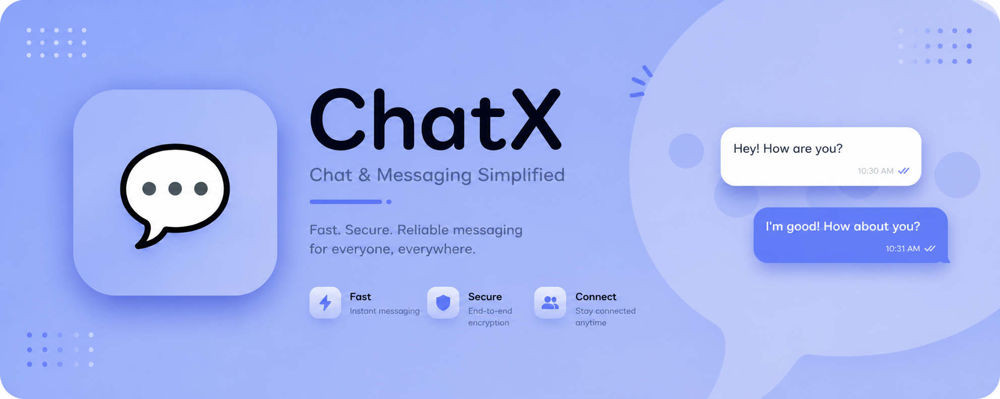

  <!-- Replace with your actual logo URL once available -->
  

<h1 align="center">ChatX</h1>

  <strong>Real‑time. Private. Built together.</strong>

  ChatX is an open‑source communication platform designed for speed, privacy, and community ownership.  
  No walls, no vendor lock‑in – just honest code and real connections.

  <a href="#-key-features">Features</a> •
  <a href="#-tech-stack">Tech Stack</a> •
  <a href="#-get-involved">Get Involved</a> •
  <a href="#-community">Community</a>

---

## 🧭 Our Mission

We believe messaging should be **free, secure, and transparent**. ChatX is built by developers from around the world who share one goal: create a communication tool that users can trust and extend.

Everything we do is open – from the code to the roadmap. You are not a user; you are a co‑creator.

## ✨ Key Features

- **Instant messaging** – one‑on‑one, groups, and channels  
- **End‑to‑end encryption** for private conversations  
- **Rich media sharing** – images, videos, files, voice notes  
- **Voice & video calls** – clear, low‑latency, group calls  
- **Cross‑platform** – Web, Desktop (Windows/Linux/macOS), Mobile (iOS/Android)  
- **Self‑hostable** – run your own instance for full control  
- **Bots & integrations** – extend ChatX with custom tools  

## 🛠️ Tech Stack – Standalone & Decoupled

Every component of ChatX is **independent**. The backend does not depend on the frontend, and each client (Web, Desktop, Android) can be developed, tested, and run separately.

| Area               | Technologies                                                              |
|--------------------|---------------------------------------------------------------------------|
| **Web Frontend**   | React (standalone SPA)                                                   |
| **Desktop App**    | Electron (standalone, communicates via APIs)                             |
| **Android App**    | **Native Android (Kotlin / Java)** – built with Android Studio            |
| **iOS App**        | *(Future – Swift / UIKit, also standalone)*                              |
| **Backend**        | Node.js + TypeScript **or** Go (community decision) – fully independent  |
| **Database**       | PostgreSQL, Redis (backend owns them)                                    |
| **Real‑time**      | WebSockets, WebRTC                                                        |
| **APIs**           | REST + GraphQL (backend exposes, any client can call)                    |
| **Deployment**     | Docker, Kubernetes (optional for backend)                                |

✅ **No component requires another to function.**  
✅ **You can run the backend alone, the Android app alone (with mock data), etc.**  
✅ **Open for community discussion** – help us choose between Node.js and Go for the backend!

> *The exact stack is open for discussion. Join our GitHub Discussions and help shape ChatX!*

## 🤝 Get Involved

ChatX welcomes **everyone** – developers, designers, testers, writers, and enthusiasts.

### Ways to contribute

- 🐛 **Report bugs** – open an issue with clear steps  
- 💡 **Suggest features** – start a discussion  
- 📝 **Improve docs** – fix typos, write tutorials, translate  
- 💻 **Write code** – pick a `good-first-issue` or `help-wanted` label  
- 🌍 **Translate** – make ChatX accessible worldwide  

### First time contributing?

We have **detailed contribution guidelines** and a friendly community that will help you land your first pull request. No contribution is too small.

👉 [See our Contributing Guide](CONTRIBUTING.md)  
👉 [Read our Code of Conduct](CODE_OF_CONDUCT.md)

## 🌍 Community & Support

Connect with the ChatX community:

- **GitHub Discussions** – ask questions, share ideas  
- **Discord / Matrix** – real‑time chat with maintainers and contributors *(invite link coming soon)*  
- **X (Twitter)** – [@chatxapp](https://twitter.com/chatxapp) – news and updates  

## 📄 License

ChatX is open source under the **MIT License**. Use it, modify it, share it – freely.

---

  <i>Built with ❤️ by the ChatX community – from India to the world.</i>

